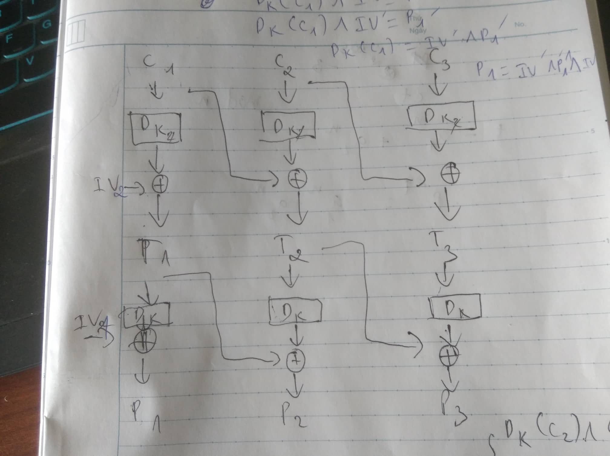

# Padding Oracle Attack 2 - ACSC CTF 2021

## Tóm tắt đề

Lúc đầu ta phải `create user` nếu nhập tên mình thì `"is_admin": False` còn nếu nhấn enter không thì `"is_admin": True` nhưng ta không biết `username`

```py
def create_user():
    username = input("Your username: ")
    if username:
        data = {"username": username, "is_admin": False}
    else:
        # Default token
        data = {"username": hidden_username, "is_admin": True}
    token = encrypt(json.dumps(data).encode())
    print("Your token: ")
    print(base64.b64encode(token).decode())
```

Func `encrypt` encrypt bằng mode CBC 2 lần:

```py
def encrypt(msg):
    aes1 = AES.new(key, AES.MODE_CBC, iv1)
    aes2 = AES.new(key, AES.MODE_CBC, iv2)
    enc = aes2.encrypt(aes1.encrypt(pad(msg, 16)))
    return iv1 + iv2 + enc
```

Sau khi login xong ta sẽ có chức năng `Show flag` nếu có `"is_admin"` trong user và `user["is_admin"] = True` ta sẽ có flag :

```py
def user_menu(user):
    print("1. Show flag")
    print("2. Log out")
    print("3. Exit")

    try:
        inp = int(input("> "))
    except ValueError:
        print("Wrong choice!")
        return None

    if inp == 1:
        if "is_admin" in user and user["is_admin"]:
            print(flag)
        else:
            print("No.")
        return user
    elif inp == 2:
        return None
    elif inp == 3:
        exit(0)
    else:
        print("Wrong choice!")
        return None
```

Ý tưởng ban đầu lúc mới nhìn của mình là `bit-flip` ở chỗ `data = {"username": username, "is_admin": False}`, thế nhưng vì là mã hoá 2 lần mà giai đoạn trung gian ta không biết thông số nào, nên ta không `bit-flip` được.

Ta chuyển hướng sang hướng tấn công `data = {"username": hidden_username, "is_admin": True}` ta phải recover được `hidden_username`. Để recover `hidden_username` ta vẫn sẽ sử dụng `Padding oracle attack`, vậy ta sẽ attack như nào ?

Lúc đầu chỉ nghĩ đơn giản là sửa code từ 2 block sang 3 block thì cũng đơn giản thôi :v

```py
from pwn import *
from base64 import *

def padding_oracle_attack (pre_block, mid_block, block):
    pre_block_fake = b'0'*16
    update = b''
    Dk = b''
    for i in range(15,-1,-1):
        for j in range(256):
            #brute-force c
            cj = bytes([j])
            pre_block_fake = pre_block_fake[:i] + cj + update 
            ciphertext_fake = base64.b64encode(pre_block_fake + mid_block + block)

            r.recvuntil(b'> ')
            r.sendline(b'2')
            r.recvuntil(b'Your username: ')
            r.sendline(b'')
            r.recvuntil(b'Your token: ')
            r.sendline(ciphertext_fake)
            resp = r.recvline()
            
            if b'Check your token again' not in resp:
                # Bước 1
                Dk = xor(bytes([16-i]), cj) + Dk
                P = xor(Dk, pre_block[i:])
                print(P)
                # Buớc 2
                P_fake_target = (16-i) * bytes([16-i+1])
                update = xor(Dk, P_fake_target)
                break
    return P

r = process(['python3','CBCBC.py'])
r.recvuntil(b'> ')
r.sendline(b'1')
r.recvuntil(b'Your username: ')
r.sendline(b'')
r.recvuntil(b'Your token: \n')
ciphertext = r.recvline().strip().decode()
ciphertext = b64decode(ciphertext)
iv1, iv2, c1, c2, c3 = ciphertext[:16], ciphertext[16:32], ciphertext[32:48], ciphertext[48:64], ciphertext[64:96]

p1 = padding_oracle_attack(iv1, iv2, c1)
p2 = padding_oracle_attack(iv2, c1, c2)
p3 = padding_oracle_attack(c1, c2, c3)

plaintext = p1 + p2 + p3
print(plaintext)
```

Nhưng chả hiểu sao chỉ đúng một block đầu :( 


Nhưng lúc vẽ hình ra mới thấy lý do



Đó là do block 1 có đủ cả c1, iv2, iv1 còn các block khác như block 2 bị thiếu t1 (đóng vai trò như iv1), nên giờ ta phải recover t1.

Tất nhiên việc recover t1 là một thách thực, may thay ta có thể đoán trước được p3. Vì độ dài `{"username": "", "is_admin": True}` là 34 nên `hidden_username` <= 13 (48 - 1 - 34). 

p3 có 13 khả năng và có thể tính Dk(T3) qua `Padding Oracle Attack` ta cũng sẽ tính được 13 khả năng của t2. t2 = Dk(t3) ^ p3

Tính được t2 ta sẽ tính được Dk(c2) = t2 ^ c1

Bây giờ nếu ta gửi `iv1-modified || c1 ^ Dk(c2) || c2` nhìn vào hình ta thấy t2 = Dk(c2) ^ c1 ^ Dk(c2) = c1. Từ đây sử dụng Padding Oracle ta sẽ tính được Dk(c1) và ta sẽ tính được t1 = Dk(c1) ^ iv2.

Giờ thì tiếp tục Padding oracle ta sẽ recover được p2 thôi.


Như vậy plaintext hoàn chỉnh là : `{"username": "R3dB1ackTreE", "is_admin": True}`

Lụm flag


[Script](./solve.py)
